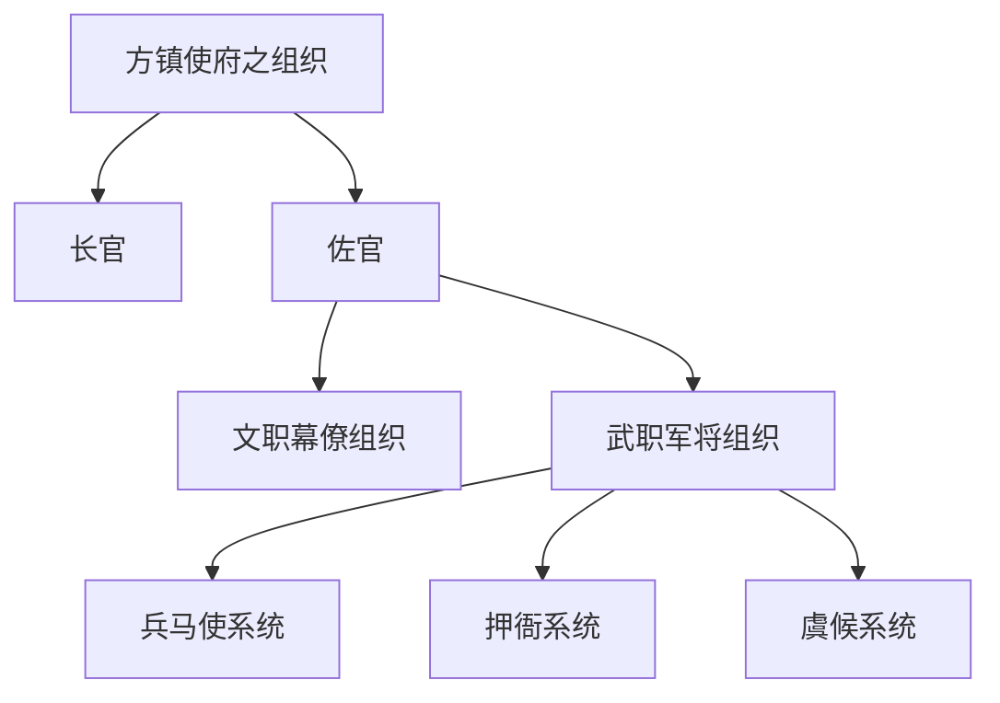

+++
title = '唐藩镇与道关系梳理'
date = '2026-09-24T14:54:29+08:00'
draft = false
tags = ['history']
ShowToc = true
description = ''
+++

### 道与藩镇的关系

> 唐代的藩镇称作“道”。道的长官为观察使，雄藩重镇的长官又兼节度使... 《唐代藩镇研究》

    批注：藩镇称作道，但道不能直接等同于藩镇。详见后文（道的历史演变）

《中国政治制度史纲》

> 唐代前期，主要者为州、县（汉为郡、县）二级制，州之特别重要者称为府（只几个）。州上有道，非行政机构，如侯景为河南道行台，当时只管军事。唐初州之上承南北朝及隋制有都督府（通常约四十上下），然其对州之统制权力不强。
> 
> 后期为方镇、州府、县三级制，方镇亦称为道，统州府，如南北朝之都督府。

    道（前期）：地理名词 --> 监察区 --> 采访使监察区 

> 唐初贞观十道，本为地理名词，非行政区划，亦非监察区划。故此时尚为州、县二级制。高宗、武后以后，渐成为监察区，仍非行政区划。至玄宗时代成为正式且经常置采访使之监察区，有十五道，多至十六七道。

    道（后期）：旧有的道 - 地理名词；藩镇也称作“道”，以藩镇为基础的“道”。

> 安史乱后，旧有之道大部分又只是地理名称；<u>**其与政治有关系者惟方镇而已，亦称为道，通常有三十余至四十个方镇。各统州府三、四个，多至十余个。**</u>方镇（道）统州府，州府统县，是为三级制。

### 藩镇组织架构

兵马使系统

> 兵马使系统：都知兵马使、左右厢兵马使、兵马使等，职主治兵作战，实掌兵权。叛变者多由此等人发起。

武职军将组织三系统的关系

> 此三者可谓一司外，一治内，一督察，三分其职，共治军务。其长官皆以都为称，可称三都，为使府重职。晚唐又置教练使、都教练使，与三都可谓军将四要职。

